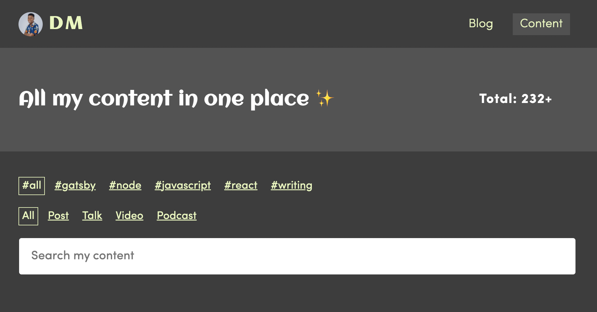
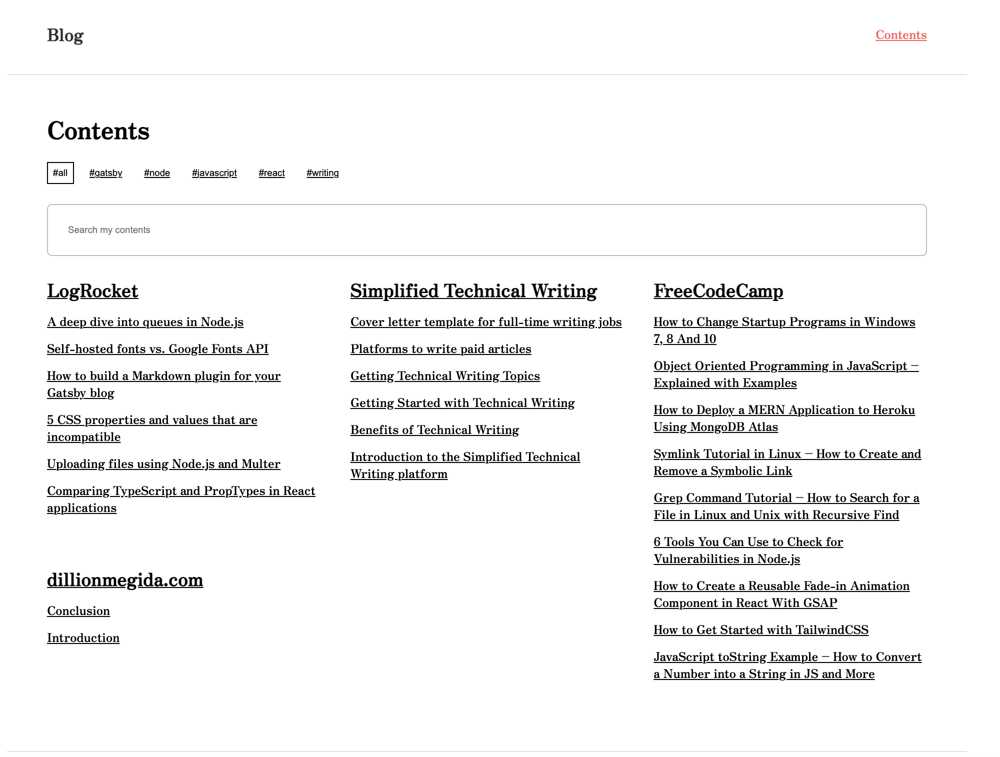

# gatsby-starter-all-content

This is a template for the [content page of my website](https://dillionmegida.com/content):



Anyone interested in having something--where all content you've written on different platforms can be stored in one place--you're free to use this template.

## Installation

You can use this starter with these commands:

```bash
gatsby new YOUR-WEBSITE https://github.com/dillionmegida/gatsby-starter-all-content

# goto your website directory
cd YOUR-WEBSITE

# start server
gatsby develop
```

On `localhost:8000`, you'll find two pages: the blog and content pages. The content page looks similar to this:



These are all demo content.

The content page is a compilation of all your content, including the blog posts on your website.

Read the following section to learn how to add your own content.

## Usage

All content live in the two directories: `data/blog` and `data/content`. The former is for blog posts on your website, and the latter is for all content you've written on different platforms.

For the latter, files are named by their platform with the `.yml` extension. For example, hashnode's content are stored in `data/content/hashnode.yml`. The structure of the file is as follows:

```yaml
- platform: Hashnode
  link: [link to your hashnode profile, or null]
  content:
    - item:
      title: [title1 of your content]
      link: [link to your content]
      tags: [helpful tags for your content]
    - item:
      title: [title2 of your content]
      link: [link to your content]
      tags: [helpful tags for your content]
    - ...and so on
```

You can add as many content in the `content` array.

### Adding new platforms

The first step is adding the file as described above to add a new platform.

Then you'd need to do a few more things:

In `src/pages/content`, create a new graphql query in the exported query object below the file. Say your platform is Hashnode, you'd need to add the following query:

```graphql
hashnode: allHashnodeYaml {
      edges {
        node {
          id
          platform
          link
          content {
            title
            link
            tags
          }
        }
      }
    }
```

Next, add this platform to the `allContent` array in the `Content` component in the same file:

```js
//
const {
  // previous content here
  // ..,
  hashnode,
} = data
const allContent = [
  // add previous content to the array
  // ..,
  hashnode,
]
//
```

And that's all. On your content page, you can see the content of your new platform.

Also, note that the order of the platforms in the `allContent` array determines how they are displayed on the content grid.

## Helpful Notes

- [react-mansory-css](https://www.npmjs.com/package/react-masonry-css) is the library used to display the mansory grid layout. Thank you, Paul.
- [use-media](https://www.npmjs.com/package/use-media) is the library used to change the number of columns based on the screen side. Thank you streamich.

## Contributing

Highly recommended. Please create a pull request if you have contributions.
